# Lights

## Starter Pack

In 3D graphics, lights are used to illuminate objects in the scene. They can be used to simulate the light coming from the sun, a lamp, or any other light source.

### Scene without lights

Run the starter code:
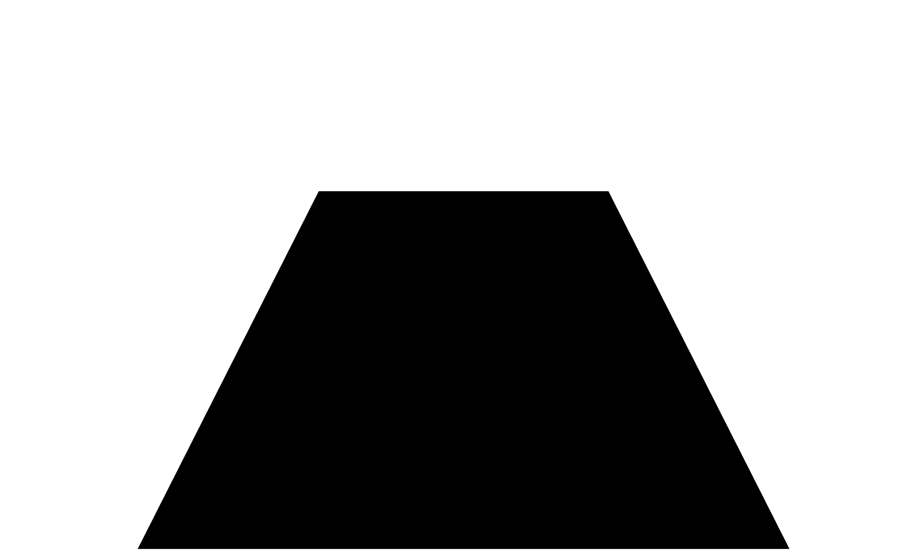
As you can see, the scene is completely dark.

This is because we haven't added any light to it yet, and the materials used are `<meshStandardMaterial />`.

Let's discover the different types of lights available in Three.js.

### Ambient Light

The simplest type of light is the ambient light. It illuminates all objects in the scene equally, regardless of their position or orientation.

The intensity prop defines the brightness of the light. The default value is 1:

```jsx
<ambientLight intensity={0.5} />
```

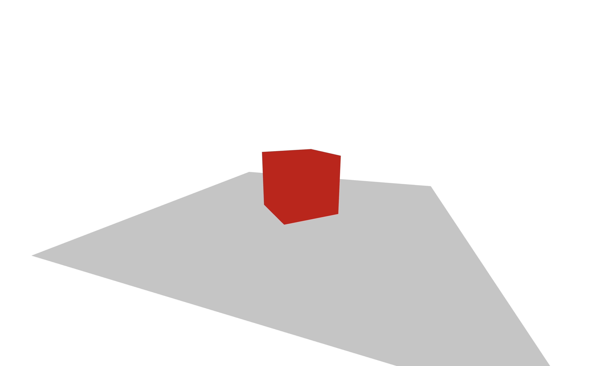
The color prop defines the color of the light. The default value is #ffffff (white):

```jsx
<ambientLight intensity={0.5} color={"royalblue"} />
```

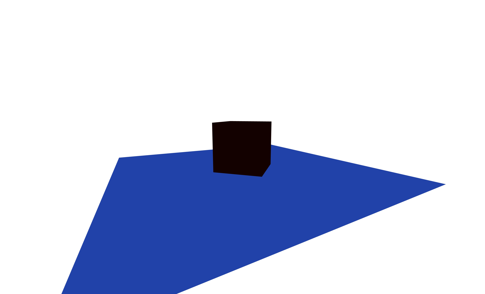

### Directional Light

A directional light is a light that is infinitely far away.

It illuminates all objects in the scene from a specific direction.

The direction of the light is defined by its position and target props.

As the target default value is (0, 0, 0), we can just use the position prop to define the direction of the light.

```jsx
<directionalLight position={[3, 3, 3]} intensity={0.5} />
```

Like the ambient light, it has a color and an intensity prop.
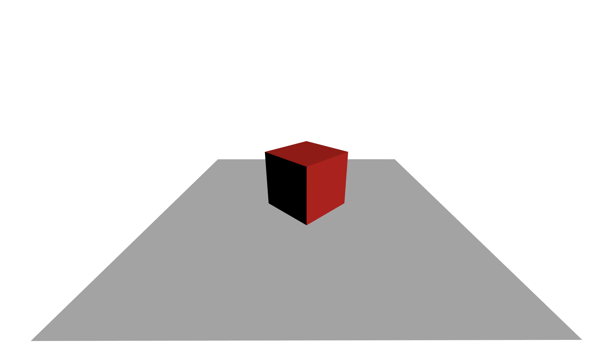

Try to switch the cube to white and add multiple directional lights with different colors to see how they interact with it:

```jsx
<ambientLight intensity={0.2} />
<directionalLight position={[0, 3, -3]} intensity={0.5} color={"green"} />
<directionalLight position={[3, 3, 3]} intensity={0.5} color={"red"} />
<directionalLight position={[-3, 3, 3]} intensity={0.5} color={"blue"} />
<mesh rotation-y={Math.PI / 4}>
  <boxGeometry />
  <meshStandardMaterial color="white" />
</mesh>
```

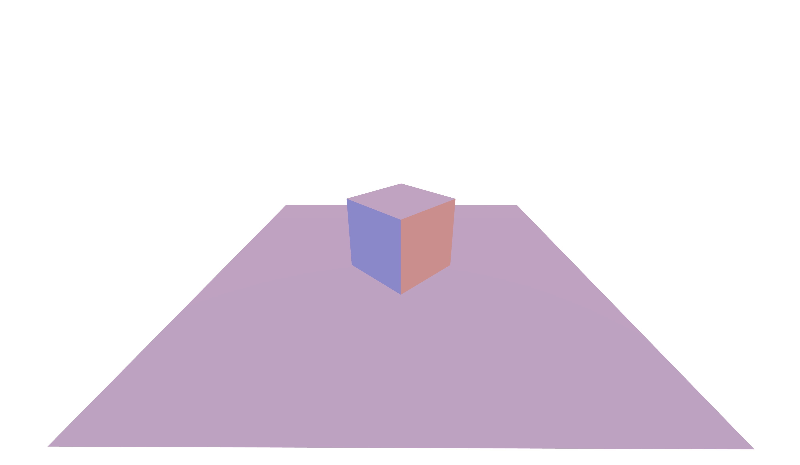

### Point Light

A point light emits light from a single point in all directions. Think of a light bulb.

```jsx
<pointLight position={[0, 10, 0]} intensity={0.5} />
```

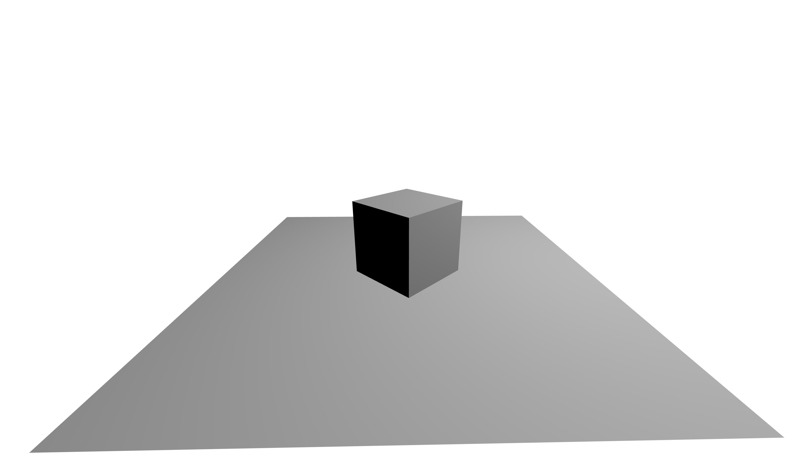

It has a distance prop that defines the distance of the light. The default value is 0, which means that the light illuminates all objects in the scene.

It also has a decay prop that defines how the light intensity diminishes along the distance of the light. The default value is 2.

By playing with the distance and decay props, you can make the light illuminate only a specific area and create very cool effects.

```jsx
<pointLight position={[1, 1, 0]} intensity={0.5} distance={3} />
```

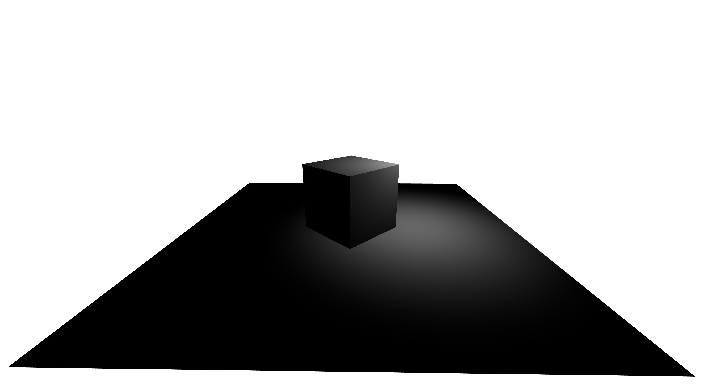
It can become very tricky and time-consuming to find the right values for the perfect prop combination...

But we have solutions for that!

Let's use:

- the point light helper to help us visualize where the light is
- Leva to create a UI to control the light props

```jsx
import { OrbitControls, useHelper } from "@react-three/drei";
import { useRef } from "react";
import { useControls } from "leva";
import * as THREE from "three";

const Lights = () => {
  const ref = useRef();
  const helper = useHelper(ref, THREE.PointLightHelper, 0.5, "red");
  const { color, distance, intensity, decay } = useControls({
    color: "#ff0000",
    distance: 3,
    intensity: 0.5,
    decay: 2,
  });
  return (
    <>
      <pointLight
        ref={ref}
        position={[1, 1, 0]}
        color={color}
        intensity={intensity}
        decay={decay}
        distance={distance}
      />
    </>
  );
};

function App() {
  return (
    <>
      <Canvas camera={{ position: [0, 3, 3] }}>
        <Lights />
      </Canvas>
    </>
  );
}
```

To use drei hooks, we need to be inside a `<Canvas />` component. That's why I wrapped our light in a `<Lights />` component.
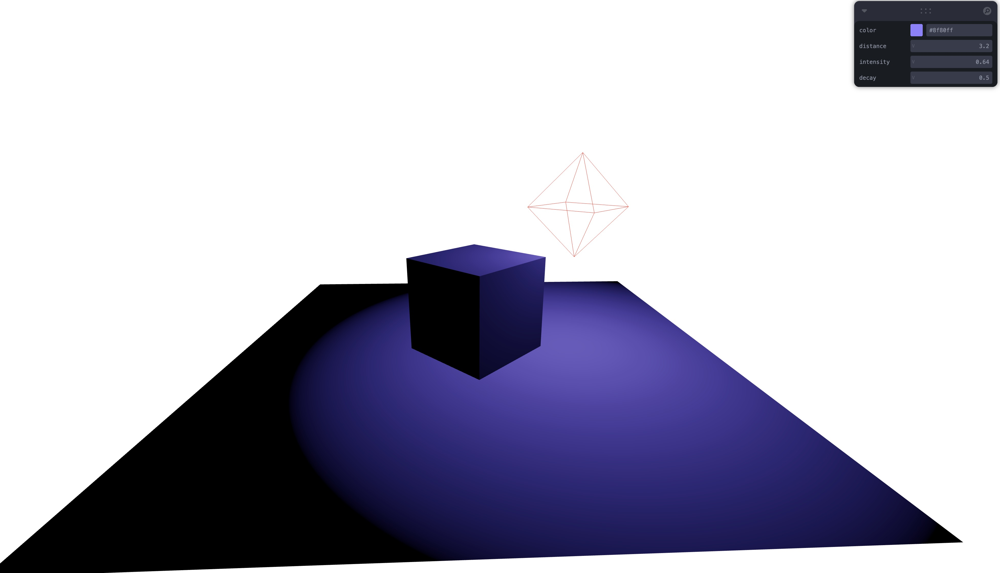

### Hemisphere Light

A hemisphere light is a light that has a color for the sky (`color`) and a color for the ground (`groundColor`).

It is often used to simulate the light coming from the sky:

```jsx
<hemisphereLight
  color={"deepskyblue"}
  groundColor={"sandybrown"}
  intensity={1}
/>
```


### Spot Light

A spot light is a light emitted from a single point in one direction, along a cone that increases in size the further from the light it gets. Think of a flashlight.

As the drei library provides a `<Spotlight />` component to simplify the creation of a spot light, we will use it instead of the `<spotLight />` component:

```jsx
import { OrbitControls, SpotLight, useHelper } from "@react-three/drei";

const helper = useHelper(ref, THREE.SpotLightHelper, "red");
const { color, distance, attenuation, angle, anglePower } = useControls({
  color: "#876ae5",
  distance: 6,
  attenuation: 2.2,
  angle: 1,
  anglePower: 1,
});
return (
  <>
    <SpotLight
      ref={ref}
      color={color}
      distance={distance}
      angle={angle}
      attenuation={attenuation}
      anglePower={anglePower}
    />
  </>
);
```

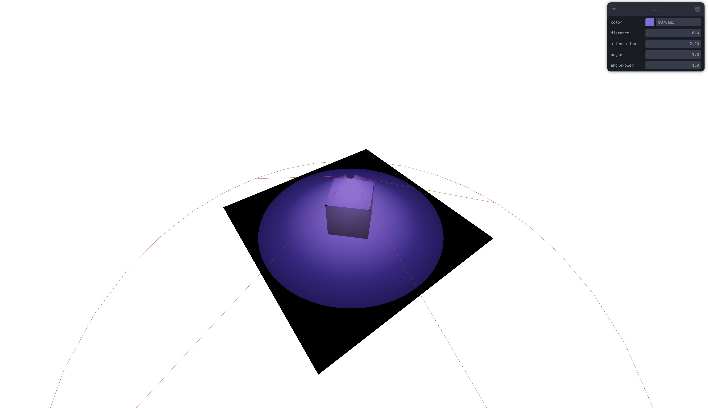

## Materials

Scene lighting is one part of the equation. The other part is the materials used by the objects.

We can adjust the material roughness and metalness to make the object more or less reflective.

```jsx
<mesh rotation-y={Math.PI / 4}>
  <boxGeometry />
  <meshStandardMaterial color="white" roughness={1} metalness={0} />
</mesh>

<mesh rotation-x={-Math.PI / 2} position-y={-0.5}>
  <planeGeometry args={[5, 5]} />
  <meshStandardMaterial color="white" roughness={0.2} metalness={0.8} />
</mesh>
```

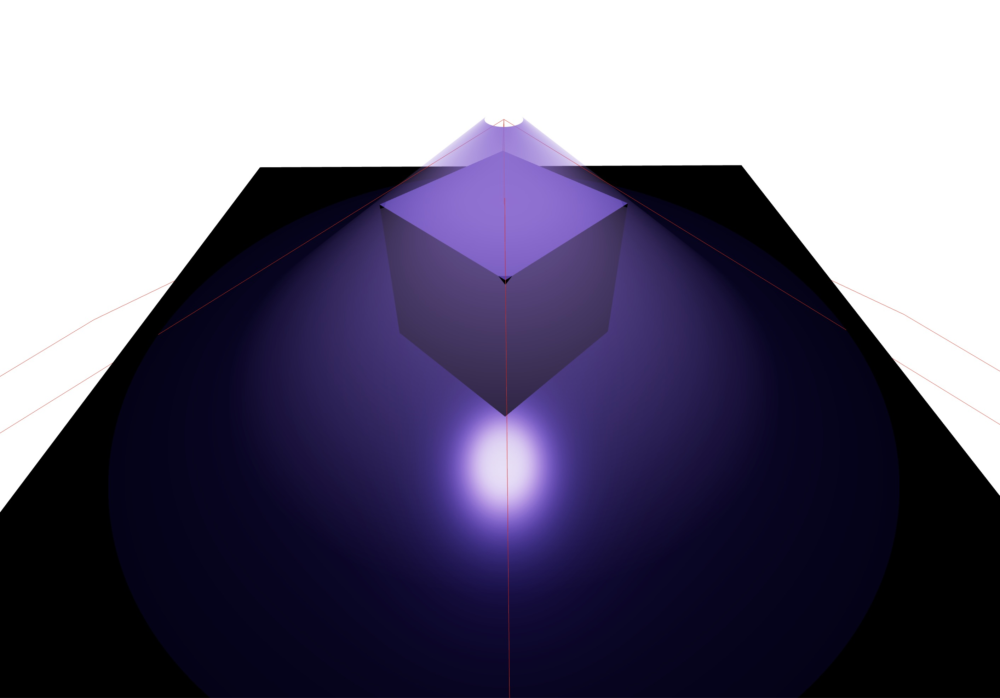
The cube is not reflective at all, while the plane reflects the spot light.

But we can also get very different results by using other reflective materials like the `meshPhysicalMaterial` on the plane:

```jsx
<mesh rotation-x={-Math.PI / 2} position-y={-0.5}>
  <planeGeometry args={[5, 5]} />
  <meshPhysicalMaterial color="white" clearcoat={0.5} reflectivity={0.8} />
</mesh>
```

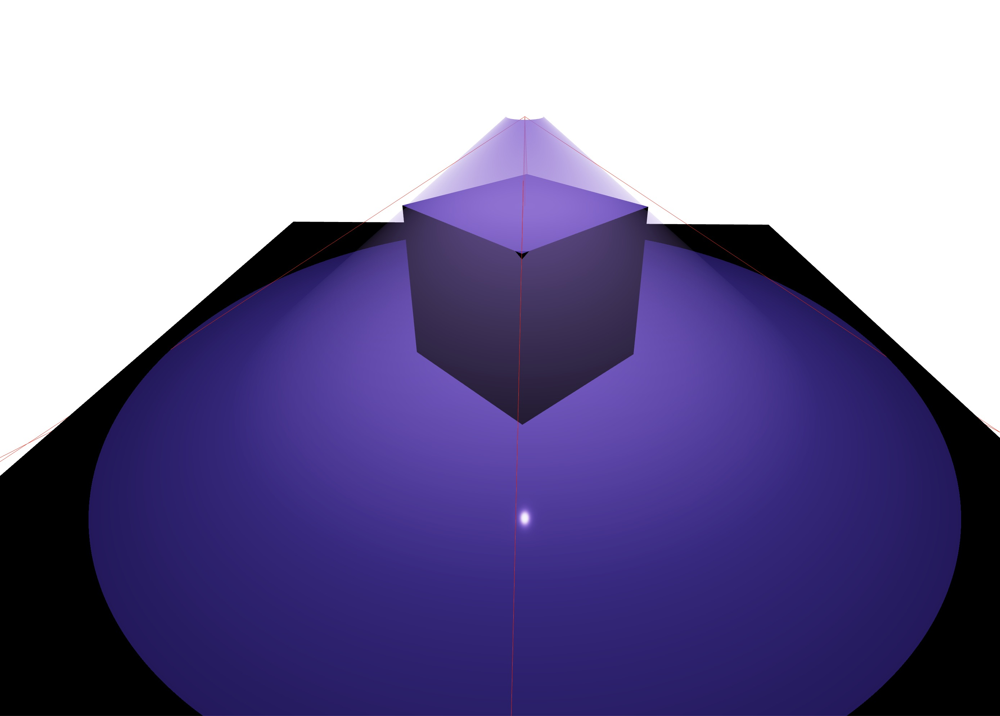
The plane is still reflecting the light, but the result is pretty different.
